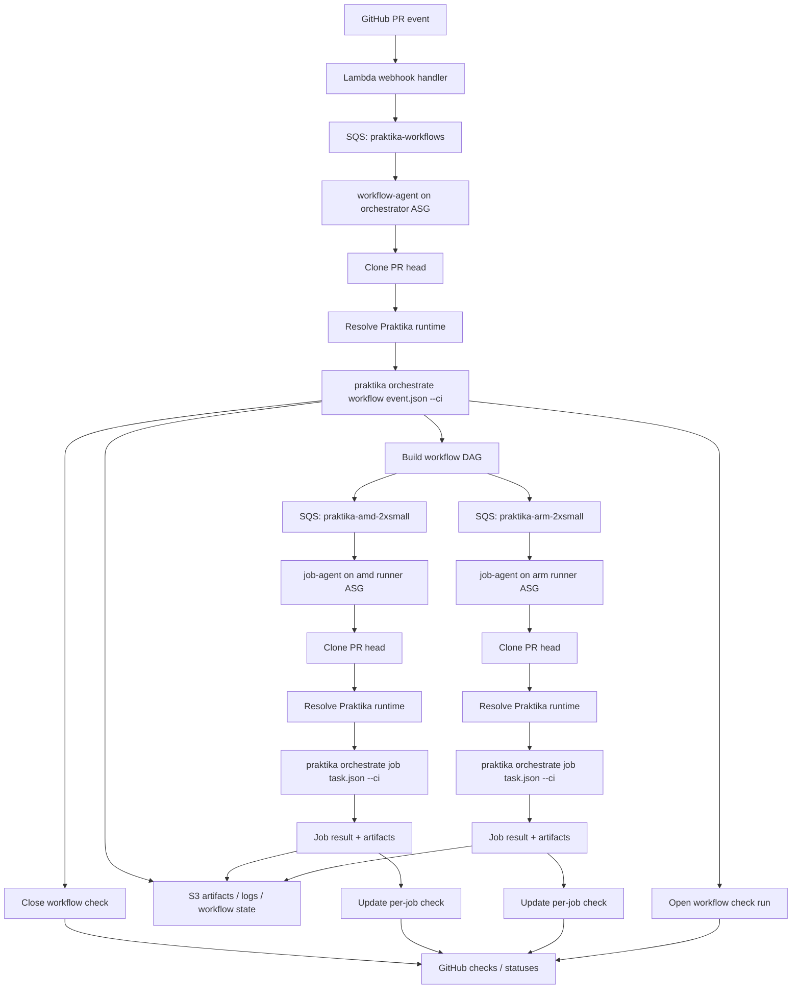
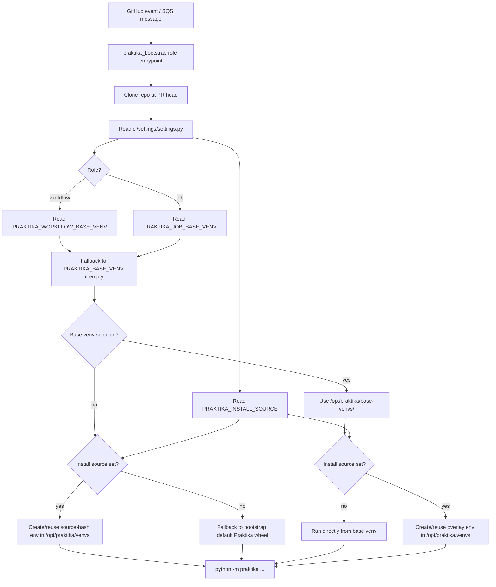

# CI Engine

Standalone CI engine that replaces GitHub Actions scheduling with direct
webhook-driven workflow orchestration + SQS-based job dispatch to pools of
long-lived EC2 runners.

## Architecture

```
GitHub webhook
    |
    v  (HMAC-verified PR event)
Lambda (ci/praktika/infrastructure/native/lambda_ci_engine.py)
    |
    v  (enqueues {type, repo, pr_number, head_sha, ...})
SQS praktika_clickhouse_workflows
    |
    v
Orchestrator ASG (praktika-workflow-orchestrator-asg)
    user_data -> praktika_bootstrap workflow_orchestrator
        |-- clone the PR head
        |-- install/reuse Praktika venv keyed by source hash
        |-- subprocess: praktika orchestrate workflow event.json --ci
        |       |-- open per-workflow GitHub check run (`PR`, in_progress)
        |       |-- find_workflow_for_event
        |       |-- build_job_dag
        |       |-- WorkflowState execution loop:
        |       |     for each JobState kicked:
        |       |       open per-job GitHub check run (queued -> in_progress)
        |       |       send {type: "job_task", ...} to SQS queue praktika-<runs_on>
        |       |-- close per-workflow check
    |
    v  (SQS: one queue per runner pool, named praktika-<runs_on>)
Runner ASGs (e.g. praktika-arm-2xsmall)
    user_data -> praktika_bootstrap job_runner
        |-- clone the PR head
        |-- install/reuse Praktika venv keyed by source hash
        |-- subprocess: praktika orchestrate job task.json --ci
        |       |-- job_runner.run_job(task) -> Runner().run(...)
```

### Interaction diagram



## Code split (intentional)

The orchestrator and runner are each composed of two pieces — one stable
bootstrap package that's installed by the EC2 user_data, and one orchestrator
module that ships with each PR:

|                   | Installed by user_data (needs LT+ASG redeploy or wheel refresh to change) | Ships with each PR (plain `git push`) |
|-------------------|--------------------------------------------------------|---------------------------------------|
| **Workflow side** | `praktika_bootstrap run_workflow` — SQS poll, clone, GH App token, cached venv reuse, S3 log | `__init__.py::orchestrate`, `state.py` (`WorkflowState`, `JobState`, `JobCheckRun`) |
| **Job side**      | `praktika_bootstrap run_job` — SQS poll, clone, GH App token, cached venv reuse, S3 log | `job_runner.py::run_job` (maps task -> `praktika.Runner.run`) |

When you want to tweak workflow orchestration or job-execution policy, you
only need `git push`. Only the stable bootstrap layer requires an LT/ASG redeploy
or bootstrap wheel refresh.

## Runtime resolution

Praktika runtime selection is split between three layers:

| Layer | Component | What it owns |
|---|---|---|
| **Image bake** | `ImageBuilder.Config.prebuilt_venvs` in `ci/infra/cloud.py` | Creates named base venvs under `/opt/praktika/base-venvs/<name>` |
| **Repo settings** | `ci/settings/settings.py` | Selects which base venv the workflow side and job side should use, and whether Praktika should also be installed from source |
| **Bootstrap** | `praktika_bootstrap` | Resolves the settings, picks the base venv, and optionally creates a source-overlay venv under `/opt/praktika/venvs/` |

Current side-specific settings:

| Setting | Used by | Meaning |
|---|---|---|
| `PRAKTIKA_WORKFLOW_BASE_VENV` | `praktika_bootstrap run_workflow` | Base venv name for the orchestrator side |
| `PRAKTIKA_JOB_BASE_VENV` | `praktika_bootstrap run_job` | Base venv name for the runner side |
| `PRAKTIKA_BASE_VENV` | both sides | Fallback if the side-specific setting is empty |
| `PRAKTIKA_INSTALL_SOURCE` | both sides | If set, install Praktika from this source on top of the selected base venv |

Current repo policy in `ci/settings/settings.py`:

- Workflow side uses base venv `praktika-orchestrator`
- Job side uses base venv `praktika-runner-pytest`
- Both sides install Praktika from source via `PRAKTIKA_INSTALL_SOURCE="."`

This means:

- the image provides stable Python/tooling dependencies
- the checked-out PR provides the Praktika code itself
- bootstrap combines them into the final runtime used for that dispatch

### Resolution flow



### Venv layout

| Path | Created by | Purpose |
|---|---|---|
| `/opt/praktika/base-venvs/praktika-orchestrator` | Image Builder | Minimal workflow/orchestrator Python base |
| `/opt/praktika/base-venvs/praktika-runner-pytest` | Image Builder | Runner Python base with `pytest` |
| `/opt/praktika/venvs/praktika-<py>-<hash>` | bootstrap | Source-only env when no base venv is selected |
| `/opt/praktika/venvs/praktika-<base>-<py>-<hash>` | bootstrap | Overlay env built from a named base venv plus Praktika source |

### Which component changes what

- Change `ci/infra/cloud.py` when you want a different prebaked base venv or different image-level tooling.
- Change `ci/settings/settings.py` when you want to select a different base venv for workflow/job dispatches.
- Change `PRAKTIKA_INSTALL_SOURCE` when you want Praktika code to come from the checked-out repo instead of the default bootstrap wheel.
- Change `bootstrap/src/praktika_bootstrap/venv_manager.py` only when the runtime composition algorithm itself needs to change.

## Debugging runner logs

`fetch_job_log.sh` fetches the full `ci-runner` systemd journal from a live
runner via SSM and extracts the log for a specific job run. It uploads the
journal to S3 first to bypass the 48 KB SSM output limit.

```bash
# List all job names seen in the current runner's journal
./ci/praktika/orchestrator/fetch_job_log.sh --list

# Fetch the most recent run of a specific job
./ci/praktika/orchestrator/fetch_job_log.sh -j "Config Workflow"

# Fetch the second-most-recent run
./ci/praktika/orchestrator/fetch_job_log.sh -j "Config Workflow" -n 2

# Target a specific runner instance
./ci/praktika/orchestrator/fetch_job_log.sh -j "Config Workflow" -i i-0abc123

# Save to a file
./ci/praktika/orchestrator/fetch_job_log.sh -j "Config Workflow" > /tmp/cw.log
```

Auto-detects the running `praktika-arm-2xsmall` runner if no `-i` is given.
Requires AWS SSM access and S3 write permission to `clickhouse-test-reports-private`.

## Local testing

### Workflow side (no AWS required)

```bash
praktika orchestrate workflow            # auto-builds the event from git state
praktika orchestrate workflow event.json # or load a pre-built event
```

Without `--ci` this runs in local-orchestrator mode: every job is dispatched as a
synchronous subprocess (`praktika orchestrate job task.json`) against the
local-fs S3 backend. Useful for end-to-end smoke tests on your machine.

### Job side (single-job sandbox)

```bash
praktika orchestrate job task.json
```

Invokes `praktika.Runner.run` with `local_orchestrator_run=True` for the job
named in the task.

Task JSON shape (what the orchestrator sends over SQS):

```json
{
  "type": "job_task",
  "repo": "ClickHouse/clickhouse-private",
  "pr_number": 55743,
  "head_sha": "...",
  "head_ref": "ci-engine",
  "workflow_name": "PR",
  "job_name": "Style check",
  "runs_on": ["self-hosted", "praktika-arm-2xsmall"]
}
```

## Naming conventions

Adding a new runner type means one call to `_runner_infra(name, instance_type)`
in `ci/infra/cloud.py`. Names derive from a single base:

| Resource | Name |
|----------|------|
| ASG      | `praktika-{name}` |
| LT       | `praktika-{name}-lt` |
| SQS queue | `praktika-{name}` |

A job's `runs_on=[X]` routes to queue `praktika-X`. There's no fallback —
if the queue doesn't exist, the dispatch fails and the job is marked
FAILURE.

## Deploy

```bash
# Workflow bootstrap infra (changes to praktika_bootstrap / user_data_orchestrator.sh):
python3 -m praktika infrastructure --deploy --only LaunchTemplate AutoScalingGroup
# Plus terminate running orchestrator instances so the ASG relaunches on the new LT.

# Job bootstrap infra (new runner types, or changes to praktika_bootstrap / user_data_runner.sh):
python3 -m praktika infrastructure --deploy --only LaunchTemplate AutoScalingGroup SQSQueue
# Plus terminate running runners on the affected pool.
```

The Praktika ASG deploy resolves `launch_template_version="$Latest"` to a
concrete version number at deploy time, so an LT bump also needs an ASG
redeploy. `$Latest` is not honored at runtime.

## What works

- Webhook -> Lambda -> SQS -> orchestrator pickup -> clone -> orchestrate
- Per-workflow `PR` GitHub check run with the full execution plan as output
- Per-job GitHub check runs (`queued` at plan time, `in_progress` on kick,
  `success`/`skipped` on completion)
- DAG-aware execution loop (`WorkflowState.get_ready` / `kick` / `wait`)
- SQS dispatch from `JobState.kick()` to per-type runner queues
- Job runner infra helper (`_runner_infra`), one deployed pool: `praktika-arm-2xsmall`
- Local sandbox: `praktika orchestrate job <task.json>` runs a real job
  end-to-end through `praktika.Runner.run` against the local-fs S3 backend

## TODO

- Completion path: runner posts a "done" event back, orchestrator's `wait()`
  long-polls it and flips `JobState` to SUCCESS/FAILURE. Today the orchestrator
  stubs a job SUCCESS the instant it's dispatched.
- Run `Config Workflow` to filter jobs (file-change / cache-hit).
- Artifact flow via `s3://clickhouse-builds/PRs/<pr>/<workflow>/<job>/...`.
- Workspace cleanup between jobs on long-lived runners (`git clean -ffdx`,
  cache reset).
- Orphan runner sweeper Lambda (mandatory tags + periodic termination).
- Self-termination on job completion (EXIT trap in `Runner.run`).
- Per-runner-type scaling (queue depth -> ASG target tracking) — currently all
  pools are fixed size 1.
